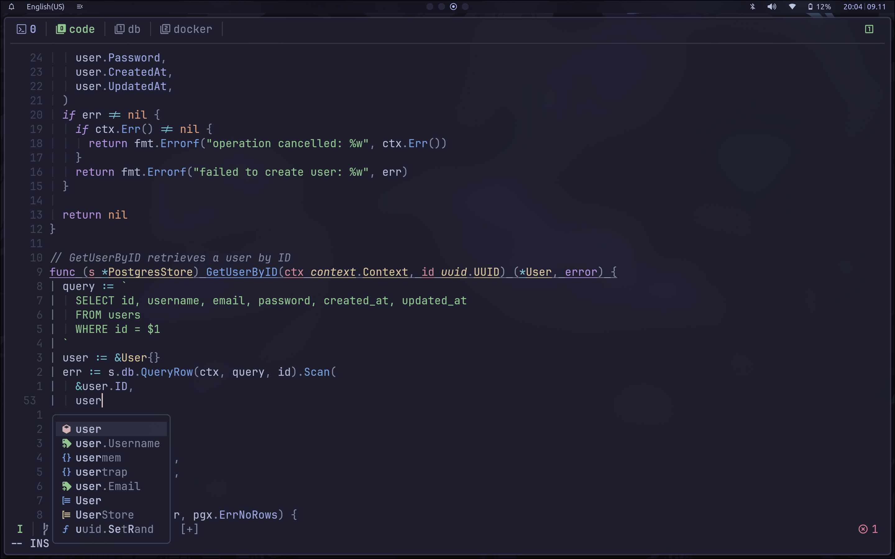
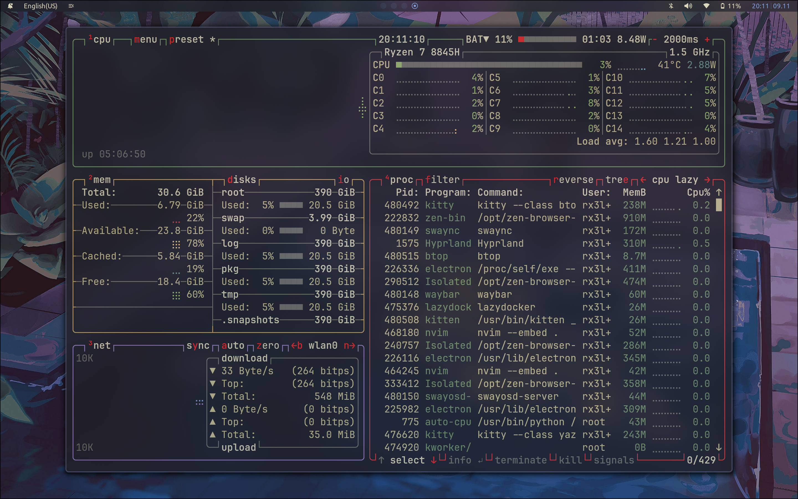
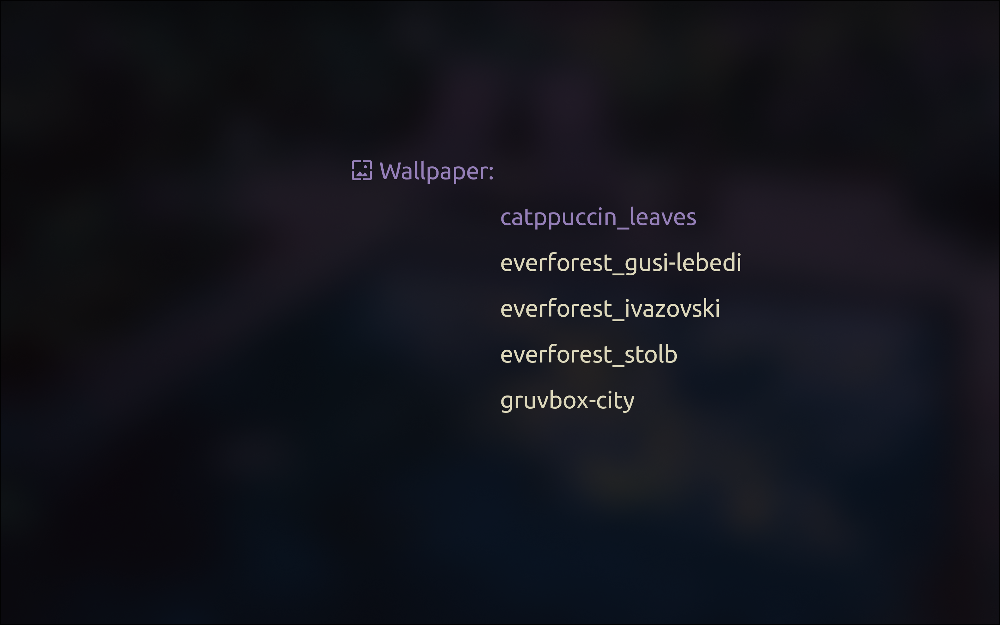
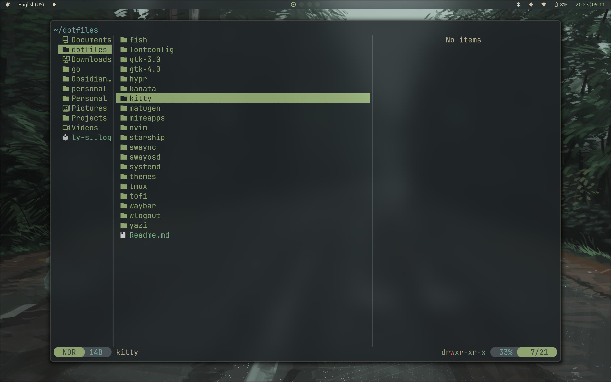
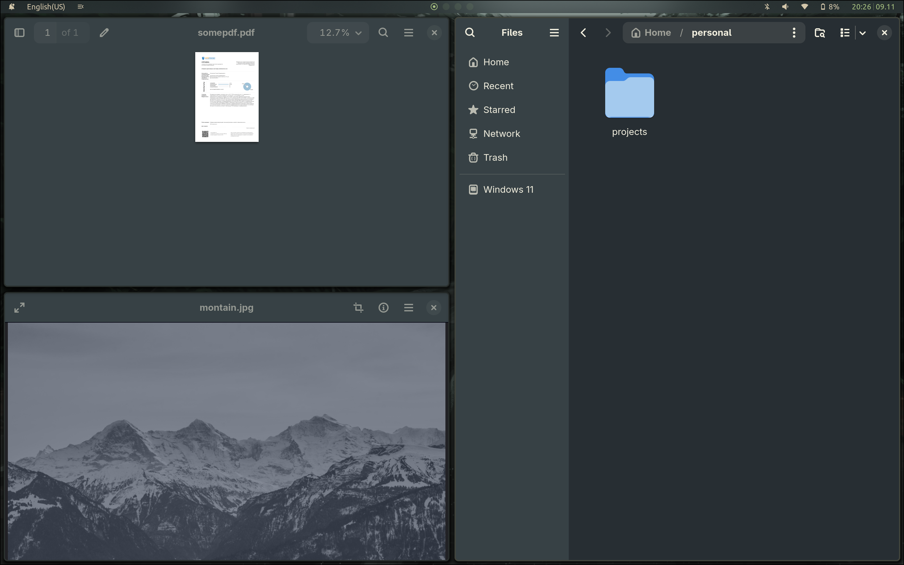
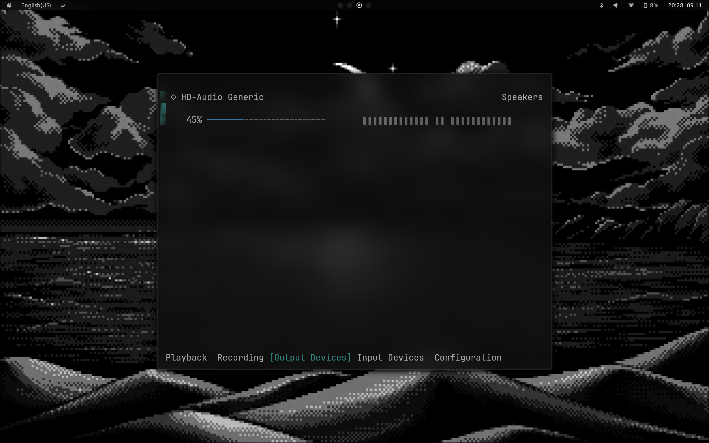

# Dotfiles

Here are my dotfiles. They are managed using GNU stow utility. In order to view all packages needed consider view `install-pkg.sh` script. In order to install Archlinux moder proper way I also recommend my complete Arch installation guide provided below. It covers a lot of things: btrfs, partitioning, snapshots, lucks encryption, essential modern tools setup and more.

#### Stack

- Window manager: hyprland
- Notification daemon and control center: swaync
- Bar: waybar
- OSD: swayosd
- Display manager: ly
- Wifi: impala (tui to manage iwd)
- Bluetooth: bluetui (tui for bluetoothctl)
- Audio: wiremix (tui for managing audio inputs/outputs)
- System monitor: btop++
- Launcher: tofi
- Lockscreen: hyprlock
- Wallpaper daemon: hyprpaper
- Screenshots / Screen video recording: hyprshot / wl-screenrec
- Terminal: kitty
- Editor: neovim
- Files: yazi (tui file manager)

#### Features

- Custom Tofi-based scripts for: Theme & wallpaper switching - Application launcher - Battery notifications & warnings - Hyprlock status display (battery, layout, media). They are easy to read, maintain and extend.
- Unified blur effect across the system. Notifications, bar, terminal, floating windows
- Theme swithcer with supported: Kanagawa, Everforest, Nord, Catppuccin, Monochrome and dynamic theme using matugen.
- Wallpaper switcher
- TUI apps

#### Screenshots:













# Arch Linux Installation Guide

## Full Disk Encryption (LUKS) + Btrfs + Snapper

**Warning**: This guide involves disk partitioning and encryption. Double-check every command before running it. Data loss is permanent!

---

## Table of Contents

1. [Pre-Installation Setup](#pre-installation-setup)
2. [Disk Encryption & Partitioning](#disk-encryption--partitioning)
3. [Btrfs Subvolume Setup](#btrfs-subvolume-setup)
4. [Base System Installation](#base-system-installation)
5. [System Configuration](#system-configuration)
6. [Bootloader Setup](#bootloader-setup)
7. [User Management](#user-management)
8. [First Boot & Package Installation](#first-boot--package-installation)
9. [Snapshot Management with Snapper](#snapshot-management-with-snapper)
10. [Performance Optimization](#performance-optimization)
11. [Development Environment](#development-environment)
12. [Additional Services](#additional-services)

---

## Pre-Installation Setup

### 1. Boot from USB and Verify UEFI Mode

```bash
# This should show files if you're in UEFI mode (which you want!)
ls /sys/firmware/efi/efivars
```

### 2. Adjust Screen Brightness (if needed)

```bash
# First, find your backlight device and check the max brightness
ls /sys/class/backlight/
cat /sys/class/backlight/*/max_brightness

# Set brightness (replace with your actual path and desired value)
echo 500 | sudo tee /sys/class/backlight/amdgpu_bl0/brightness
```

### 3. Connect to WiFi

```bash
# Start the interactive WiFi tool
iwctl

# Inside iwctl, run these commands:
device list
station wlan0 scan
station wlan0 get-networks
station wlan0 connect "YOUR_NETWORK_NAME"
exit

# Test your connection
ping -c 3 google.com
```

### 4. Sync System Clock

```bash
timedatectl set-ntp true
```

---

## Disk Encryption & Partitioning

**CRITICAL**: We're setting up full disk encryption. You'll need to enter a password every time you boot. Make it strong but memorable!

### 5. Identify Your Disk

```bash
# List all available disks - look for your main drive
lsblk
fdisk -l
```

**IMPORTANT**: Throughout this guide, we use `/dev/[YOUR_DISK]` as a placeholder. Common disk names:

- NVMe SSD: `/dev/nvme0n1`
- SATA SSD/HDD: `/dev/sda`
- Additional drives: `/dev/nvme1n1`, `/dev/sdb`, etc.

**Write down your actual disk name and replace `/dev/[YOUR_DISK]` with it in every command!**

### 6. Partition Your Disk

```bash
# VERIFY THE DISK NAME FIRST!
lsblk

# Open the partitioning tool for your disk
cfdisk /dev/[YOUR_DISK]
```

**Create these partitions:**

| Partition                                   | Size            | Type             |
| ------------------------------------------- | --------------- | ---------------- |
| `/dev/[YOUR_DISK]p1` or `/dev/[YOUR_DISK]1` | 512MB           | EFI System       |
| `/dev/[YOUR_DISK]p2` or `/dev/[YOUR_DISK]2` | Remaining space | Linux filesystem |

**Note**: NVMe drives use `p1`, `p2` (e.g., `nvme0n1p1`). SATA drives use `1`, `2` (e.g., `sda1`).

**In cfdisk:**

1. Select `gpt` if asked for label type
2. Create new partition: 512M, type: EFI System
3. Create new partition: Use remaining space, type: Linux filesystem
4. Write changes (type "yes" to confirm)
5. Quit

### 7. Setup LUKS Encryption

**This is where we encrypt your main partition:**

```bash
# DOUBLE CHECK YOUR PARTITION NUMBER!
lsblk

# Format the partition as LUKS encrypted
# You'll be asked to create a password - REMEMBER THIS PASSWORD!
cryptsetup luksFormat /dev/[YOUR_DISK]p2  # or /dev/[YOUR_DISK]2 for SATA
```

**Type `YES` (in capitals) to confirm, then enter your encryption password twice.**

```bash
# Open the encrypted partition (you'll enter your password)
# "cryptroot" is just a name - the decrypted partition will appear as /dev/mapper/cryptroot
cryptsetup open /dev/[YOUR_DISK]p2 cryptroot  # or /dev/[YOUR_DISK]2 for SATA

# Verify it's open
ls /dev/mapper/
# You should see "cryptroot" listed
```

### 8. Create Filesystems

```bash
# Format the EFI partition (the unencrypted boot partition)
mkfs.fat -F32 /dev/[YOUR_DISK]p1  # or /dev/[YOUR_DISK]1 for SATA

# Create btrfs filesystem on the encrypted partition
mkfs.btrfs -L Archlinux /dev/mapper/cryptroot
```

---

## Btrfs Subvolume Setup

**Why subvolumes?** They let you snapshot different parts of your system independently and exclude certain directories (like temporary files) from snapshots.

### 9. Create Subvolumes

```bash
# Mount the btrfs filesystem temporarily
mount /dev/mapper/cryptroot /mnt

# Create all our subvolumes
btrfs subvolume create /mnt/@
btrfs subvolume create /mnt/@home
btrfs subvolume create /mnt/@log
btrfs subvolume create /mnt/@pkg
btrfs subvolume create /mnt/@tmp
btrfs subvolume create /mnt/@snapshots

# Unmount so we can remount with proper options
umount /mnt
```

**What each subvolume is for:**

- `@` - Your root filesystem (main system files)
- `@home` - Your personal files and settings
- `@log` - System logs (we don't need to snapshot these)
- `@pkg` - Pacman package cache (saves re-downloading)
- `@tmp` - Temporary files (definitely don't snapshot these!)
- `@snapshots` - Where snapper stores snapshots

### 10. Mount Everything with Optimal Settings

```bash
# Mount root subvolume with SSD-optimized options
mount -o noatime,compress=zstd:3,ssd,discard=async,space_cache=v2,subvol=@ /dev/mapper/cryptroot /mnt

# Create all the mount point directories
mkdir -p /mnt/{home,var/log,var/cache/pacman/pkg,tmp,boot,.snapshots}

# Mount all the other subvolumes
mount -o noatime,compress=zstd:3,ssd,discard=async,space_cache=v2,subvol=@home /dev/mapper/cryptroot /mnt/home
mount -o noatime,compress=zstd:3,ssd,discard=async,space_cache=v2,subvol=@log /dev/mapper/cryptroot /mnt/var/log
mount -o noatime,compress=zstd:3,ssd,discard=async,space_cache=v2,subvol=@pkg /dev/mapper/cryptroot /mnt/var/cache/pacman/pkg
mount -o noatime,compress=zstd:3,ssd,discard=async,space_cache=v2,subvol=@tmp /dev/mapper/cryptroot /mnt/tmp
mount -o noatime,compress=zstd:3,ssd,discard=async,space_cache=v2,subvol=@snapshots /dev/mapper/cryptroot /mnt/.snapshots

# Mount the EFI boot partition
mount /dev/[YOUR_DISK]p1 /mnt/boot  # or /dev/[YOUR_DISK]1 for SATA

# Verify everything is mounted correctly
lsblk
```

**What those mount options mean:**

- `noatime` - Don't update access times (faster)
- `compress=zstd:3` - Compress files to save space
- `ssd` - SSD-specific optimizations
- `discard=async` - Helps with SSD wear leveling
- `space_cache=v2` - Better free space tracking

---

## Base System Installation

### 11. Update Keyring and Install Base System

```bash
# Refresh the keyring (avoids signature errors)
pacman -Sy archlinux-keyring

# Install the base system (this will take a few minutes)
pacstrap /mnt base base-devel \
    linux linux-firmware linux-headers \
    btrfs-progs snapper grub-btrfs \
    amd-ucode networkmanager \
    grub efibootmgr os-prober \
    vim nano git curl wget \
    mesa vulkan-radeon libva-mesa-driver \
    mesa-vdpau make cmake
```

**What we're installing:**

- Base system and kernel
- Btrfs tools and snapshot utilities
- AMD microcode and graphics drivers
- Network management tools
- Bootloader (GRUB)
- Essential build tools and utilities

### 12. Generate Filesystem Table

```bash
# Generate fstab (tells the system what to mount on boot)
genfstab -U /mnt >> /mnt/etc/fstab

# Good practice: check it looks right
cat /mnt/etc/fstab
```

### 13. Enter Your New System

```bash
# Chroot into the new installation
# From now on, commands run inside your new system
arch-chroot /mnt
```

---

## System Configuration

### 14. Set Timezone and Locale

```bash
# Set your timezone (adjust for your location!)
# Find yours with: ls /usr/share/zoneinfo/
ln -sf /usr/share/zoneinfo/Asia/Barnaul /etc/localtime

hwclock --systohc

# Setup locales (languages)
echo "en_US.UTF-8 UTF-8" >> /etc/locale.gen
echo "ru_RU.UTF-8 UTF-8" >> /etc/locale.gen
locale-gen
echo "LANG=en_US.UTF-8" > /etc/locale.conf
```

### 15. Set Hostname

```bash
# Choose your computer's name (replace with what you want)
echo "archlinux" > /etc/hostname

# Setup hosts file
cat >> /etc/hosts << 'EOF'
127.0.0.1   localhost
::1         localhost
127.0.1.1   archlinux.localdomain archlinux
EOF
```

**Replace `archlinux` with whatever name you chose!**

### 16. Set Root Password

```bash
# Set a password for the root user
passwd
```

---

## Bootloader Setup

**CRITICAL SECTION**: We need to configure GRUB to unlock your encrypted disk on boot.

### 17. Get Your Partition UUID

```bash
# Get the UUID of your encrypted partition
# Write this down or keep this terminal open!
blkid /dev/[YOUR_DISK]p2  # or /dev/[YOUR_DISK]2 for SATA
```

Copy the UUID value (it looks like: `a1b2c3d4-e5f6-...`)

### 18. Configure GRUB for Encryption

```bash
# Edit GRUB configuration
vim /etc/default/grub
```

**Find this line:**

```bash
GRUB_CMDLINE_LINUX_DEFAULT="loglevel=3 quiet"
```

**Change it to** (replace YOUR-UUID-HERE with the UUID you just copied):

```bash
GRUB_CMDLINE_LINUX_DEFAULT="loglevel=3 quiet cryptdevice=UUID=YOUR-UUID-HERE:cryptroot root=/dev/mapper/cryptroot"
```

**Also in `/etc/default/grub`, uncomment this line:**

```bash
# Enables crypto stuff for grub
GRUB_ENABLE_CRYPTODISK=y
```

**And make sure this is uncommented:**

```bash
# That allows os-prober to find windows or whatever for other boot option
GRUB_DISABLE_OS_PROBER=false
```

### 19. Configure Initramfs for Encryption

```bash
# Edit mkinitcpio configuration
vim /etc/mkinitcpio.conf
```

**Find the MODULES line and change it to:**

```bash
MODULES=(btrfs)
```

**Find the HOOKS line and add `encrypt` before `filesystems`:**

```bash
HOOKS=(base udev autodetect microcode modconf kms keyboard keymap consolefont block encrypt filesystems fsck)
```

**This is super important!** The order matters:

- `encrypt` must come before `filesystems`
- `keyboard` and `keymap` must come before `encrypt`

Save and exit.

### 20. Rebuild Initramfs

```bash
# Generate the initramfs with our encryption settings
mkinitcpio -P
```

### 21. Install GRUB

```bash
# Install GRUB to the EFI partition
grub-install --target=x86_64-efi --efi-directory=/boot --bootloader-id=GRUB --recheck

# Generate GRUB configuration
grub-mkconfig -o /boot/grub/grub.cfg
```

**You should see a message about detecting your encrypted device!**

### 22. Fix /tmp Cleanup Issue

Because `/tmp` is its own subvolume, we need to tell the system to clean it on boot:

```bash
# Create tmp cleanup configuration
mkdir -p /etc/tmpfiles.d
cat > /etc/tmpfiles.d/tmp.conf << 'EOF'
# Clean /tmp directory on every boot
D! /tmp 1777 root root 0
EOF
```

---

## User Management

### 23. Create Your User Account

```bash
# Create your user (replace USERNAME with your desired username)
useradd -m -G wheel,audio,video,optical,storage,input [USERNAME]

# Set password for your user
passwd [USERNAME]

# Give your user sudo privileges
EDITOR=vim visudo
```

**In the visudo editor, uncomment this line:**

```bash
%wheel ALL=(ALL:ALL) ALL
```

Save and exit (in vim: press `Esc`, type `:wq`, press `Enter`)

### 24. Enable NetworkManager

```bash
# Enable NetworkManager so you have internet after reboot
systemctl enable NetworkManager
```

### 25. Exit and Reboot

```bash
# Exit the chroot environment
exit

# Unmount everything
umount -R /mnt

# Reboot into your new system!
reboot
```

**Remove the USB stick when rebooting!**

**You'll now see:**

1. GRUB menu
2. Password prompt for disk decryption (enter your LUKS password)
3. Login prompt (login with your username and password)

---

## First Boot & Package Installation

Congratulations! You've installed Arch with encryption. Now let's set up everything else.kj

### 26. Connect to WiFi (if needed)

```bash
# Connect using NetworkManager
nmcli device wifi connect "YOUR_NETWORK_NAME" password "YOUR_PASSWORD"

# Test connection
ping -c 3 google.com
```

### 27. Setup Pacman Configuration

```bash
# Edit pacman configuration
sudo vim /etc/pacman.conf
```

**Uncomment or add these lines for a better experience:**

```bash
Color
ILoveCandy
ParallelDownloads = 10
```

Save and update:

```bash
sudo pacman -Syu
```

### 28. Setup Fast Mirrors with Reflector

```bash
# Install reflector
sudo pacman -S reflector

# Generate fast mirror list (adjust countries to your location)
sudo reflector --country Germany,France,Netherlands --age 12 --protocol https --sort rate --save /etc/pacman.d/mirrorlist

# Enable automatic mirror updates
sudo systemctl enable --now reflector.timer
```

### 29. Run the Package Installation Script

**Now we'll install paru and all your packages using the installation script.**

Create a file called `install-packages.sh`:

```bash
nano install-packages.sh
```

Copy the installation script contents (see the separate artifact), save and exit (Ctrl+X, Y, Enter).

Make it executable and run it:

```bash
chmod +x install-packages.sh
./install-packages.sh
```

**This will:**

1. Install paru (AUR helper)
2. Install ALL your packages using paru (both official repos and AUR)
3. Show you progress as it goes

**Note**: This will take a while.

## Snapshot Management with Snapper

**This is where the magic happens - automated system snapshots!**

### 30. Initial Snapper Setup

```bash
# Verify your btrfs subvolumes
btrfs subvolume list /
```

You should see your subvolumes including `@snapshots`.

### 31. Create Snapper Config

**This is tricky because .snapshots already exists. Here's the fix:**

```bash
# 1. Temporarily unmount @snapshots
sudo umount /.snapshots

# 2. Remove the directory
sudo rmdir /.snapshots

# 3. Create snapper config (this works now!)
sudo snapper -c root create-config /

# 4. Delete the subvolume snapper just created (we want our @snapshots)
sudo btrfs subvolume delete /.snapshots

# 5. Recreate the directory
sudo mkdir /.snapshots

# 6. Mount our proper @snapshots
sudo mount /.snapshots

# 7. Verify everything works
sudo snapper -c root list
```

### 32. Configure Snapper Settings

```bash
# Edit snapper configuration
sudo vim /etc/snapper/configs/root
```

**Change these values:**

```bash
# Timeline creation
TIMELINE_CREATE="yes"
TIMELINE_MIN_AGE="1800"          # Create snapshots max every 30 min

# How many snapshots to keep
TIMELINE_LIMIT_HOURLY="12"       # Last 12 hours
TIMELINE_LIMIT_DAILY="7"         # Last 7 days
TIMELINE_LIMIT_WEEKLY="4"        # Last 4 weeks
TIMELINE_LIMIT_MONTHLY="3"       # Last 3 months
TIMELINE_LIMIT_YEARLY="0"        # No yearly snapshots

# Safety limits
NUMBER_LIMIT="30"                # Never exceed 30 snapshots
NUMBER_LIMIT_IMPORTANT="10"      # Keep up to 10 manual snapshots

# Cleanup settings
TIMELINE_CLEANUP="yes"
NUMBER_CLEANUP="yes"
EMPTY_PRE_POST_CLEANUP="yes"
EMPTY_PRE_POST_MIN_AGE="1800"

# Performance
BACKGROUND_COMPARISON="yes"
SYNC_ACL="yes"
```

### 33. Configure GRUB-Btrfs

```bash
# Edit grub-btrfs config
sudo vim /etc/default/grub-btrfs/config
```

**Add these lines:**

```bash
GRUB_BTRFS_SUBMENUNAME="Arch Snapshots"
GRUB_BTRFS_LIMIT="30"
```

### 34. Enable Snapshot Services

```bash
# Enable automatic snapshots
sudo systemctl enable --now snapper-timeline.timer
sudo systemctl enable --now snapper-cleanup.timer

# Enable automatic GRUB updates (so snapshots appear in boot menu)
sudo systemctl enable --now grub-btrfsd.service

# Create your first snapshot!
sudo snapper -c root create --description "Fresh Installation"

# Check it worked
sudo snapper -c root list
```

---

## Performance Optimization

### 35. Setup Zram (Compressed RAM Swap)

```bash
# Configure zram
sudo tee /etc/systemd/zram-generator.conf << 'EOF'
[zram0]
zram-size = min(ram / 2, 4096)
compression-algorithm = zstd
EOF

# Enable it
sudo systemctl daemon-reload
sudo systemctl start systemd-zram-setup@zram0.service
```

### 36. Enable EarlyOOM (Prevents System Freezes)

```bash
# Enable EarlyOOM (already installed from script)
sudo systemctl enable --now earlyoom
```

### 37. Enable Auto-CPUFreq (Battery Life)

```bash
# Enable auto-cpufreq (already installed from script)
sudo systemctl enable --now auto-cpufreq
```

### 38. Check Boot Performance

```bash
# See how long your system takes to boot
systemd-analyze

# See what's taking time during boot
systemd-analyze blame
```

---

## Development Environment

### 39. Setup SSH Key

```bash
# Generate SSH key
ssh-keygen -t ed25519 -C "your_email@example.com"

# Start SSH agent
eval "$(ssh-agent -s)"

# Add key to agent
ssh-add ~/.ssh/id_ed25519

# Display public key (add this to GitHub)
cat ~/.ssh/id_ed25519.pub
```

**Add the key to GitHub:** https://github.com/settings/keys

### 40. Configure Git

```bash
# Set your name and email
git config --global user.name "Your Name"
git config --global user.email "your_email@example.com"

# Better git output
git config --global color.ui auto
git config --global init.defaultBranch main
```

### 41. Setup Dotfiles (if you have them)

```bash
# Clone your dotfiles
cd ~
git clone git@github.com:yourusername/dotfiles.git
cd dotfiles

# Use stow to symlink configs
stow */
```

---

## Additional Services

### 42. Enable Docker

```bash
# Enable Docker service
sudo systemctl enable --now docker

# Add your user to docker group (so you don't need sudo)
sudo usermod -aG docker $USER

# You'll need to log out and back in for this to take effect
```

### 43. Setup Display Manager (LY)

```bash
# Enable LY display manager
sudo systemctl enable ly.service
```

### 44. Configure Kanata (Keyboard Remapping)

```bash
# Create necessary groups
sudo groupadd -r uinput
sudo usermod -aG input,uinput $USER

# Create udev rules
sudo tee /etc/udev/rules.d/99-uinput.rules << 'EOF'
KERNEL=="uinput", MODE="0660", GROUP="uinput", OPTIONS+="static_node=uinput"
EOF

# Apply udev changes
sudo udevadm control --reload-rules
sudo udevadm trigger
sudo modprobe uinput

# Make uinput load on boot
echo "uinput" | sudo tee /etc/modules-load.d/uinput.conf

# Enable kanata service
systemctl --user enable kanata
```

**You'll need to create your kanata config at:** `~/.config/kanata/config.kbd`

---

## Essential Security Setup

**IMPORTANT**: Your system is encrypted, which is great, but we need to add more layers of security.

### 45. Install Security Essentials

```bash
# Install security packages
sudo pacman -S ufw fail2ban arch-audit
```

### 46. Setup Firewall (UFW)

UFW (Uncomplicated Firewall) is the easiest way to manage iptables.

```bash
# Enable UFW
sudo systemctl enable --now ufw

# Set default policies (deny all incoming, allow all outgoing)
sudo ufw default deny incoming
sudo ufw default allow outgoing

# Allow SSH if you use it (otherwise you'll lock yourself out remotely!)
sudo ufw allow ssh
# Or specify a custom SSH port if you changed it:
# sudo ufw allow 2222/tcp

# Allow other services you might need:
# sudo ufw allow 80/tcp      # HTTP
# sudo ufw allow 443/tcp     # HTTPS
# sudo ufw allow 8080/tcp    # Development server

# Enable the firewall
sudo ufw enable

# Check status
sudo ufw status verbose
```

**Testing UFW:**

```bash
# List all rules
sudo ufw status numbered

# Delete a rule by number if needed
sudo ufw delete [number]

# Disable UFW temporarily if something breaks
sudo ufw disable
```

### 47. Harden SSH Configuration

If you use SSH (especially if exposed to the internet):

```bash
# Backup the original config
sudo cp /etc/ssh/sshd_config /etc/ssh/sshd_config.backup

# Edit SSH config
sudo vim /etc/ssh/sshd_config
```

**Add or modify these lines:**

```bash
# Disable root login (use your user + sudo instead)
PermitRootLogin no

# Use SSH keys only, disable password authentication
PasswordAuthentication no
PubkeyAuthentication yes

# Disable empty passwords
PermitEmptyPasswords no

# Limit authentication attempts
MaxAuthTries 3

# Disconnect if no successful login within 30 seconds
LoginGraceTime 30

# Disable X11 forwarding if you don't need it
X11Forwarding no

# Use only strong ciphers and MACs
Ciphers chacha20-poly1305@openssh.com,aes256-gcm@openssh.com,aes128-gcm@openssh.com
MACs hmac-sha2-512-etm@openssh.com,hmac-sha2-256-etm@openssh.com

# Optional: Change default port (security through obscurity, but helps reduce noise)
# Port 2222

# Optional: Limit which users can SSH
# AllowUsers yourusername
```

**Restart SSH to apply changes:**

```bash
sudo systemctl restart sshd

# Verify config is valid
sudo sshd -t
```

**CRITICAL**: Test SSH access in a new terminal before closing your current session!

### 48. Setup Fail2Ban

Fail2Ban automatically bans IPs that show malicious signs (too many password failures, etc.)

```bash
# Create local configuration
sudo cp /etc/fail2ban/jail.conf /etc/fail2ban/jail.local

# Edit the config
sudo vim /etc/fail2ban/jail.local
```

**Find and modify these sections:**

```ini
[DEFAULT]
# Ban for 1 hour
bantime = 3600

# Check for failures over 10 minutes
findtime = 600

# Ban after 5 failures
maxretry = 5

# Email notifications (optional)
# destemail = your@email.com
# sendername = Fail2Ban
# action = %(action_mwl)s

[sshd]
enabled = true
port = ssh
# If you changed SSH port:
# port = 2222
```

**Enable and start Fail2Ban:**

```bash
sudo systemctl enable --now fail2ban

# Check status
sudo fail2ban-client status

# Check SSH jail specifically
sudo fail2ban-client status sshd

# Unban an IP if you accidentally locked yourself out
sudo fail2ban-client set sshd unbanip [IP_ADDRESS]
```

---

## System Maintenance

Proper maintenance keeps your system running smoothly and prevents issues.

### 49. Install Maintenance Tools

```bash
sudo pacman -S pacman-contrib pkgfile man-db man-pages tldr
```

### 50. Setup Automatic Pacman Cache Cleaning

The package cache in `/var/cache/pacman/pkg/` can grow huge over time.

```bash
# Check current cache size
du -sh /var/cache/pacman/pkg/

# Clean cache manually (keeps last 3 versions of each package)
sudo paccache -r

# Remove all uninstalled packages from cache
sudo paccache -ruk0
```

**Automate cache cleaning:**

```bash
# Enable the weekly timer to keep only last 3 versions
sudo systemctl enable --now paccache.timer

# Check when it will run next
systemctl list-timers paccache.timer
```

### 51. Setup Journal Log Rotation

Systemd journals can consume a lot of space.

```bash
# Check current journal size
journalctl --disk-usage

# Configure journal size limits
sudo vim /etc/systemd/journald.conf
```

**Modify these lines:**

```ini
[Journal]
SystemMaxUse=500M
SystemMaxFileSize=50M
MaxRetentionSec=2week
```

**Apply changes:**

```bash
sudo systemctl restart systemd-journald

# Manually clean old logs if needed
sudo journalctl --vacuum-size=500M
sudo journalctl --vacuum-time=2weeks
```

### 52. Setup Orphaned Package Cleanup

Remove packages that were installed as dependencies but are no longer needed:

```bash
# List orphaned packages
pacman -Qtdq

# Remove them
sudo pacman -Rns $(pacman -Qtdq)
```

### 53. Update Mirrorlist Regularly

Keep your mirrors fast and up to date:

```bash
# Reflector should already be set up from step 28
# Verify it's running
systemctl status reflector.timer

# Check when it will run next
systemctl list-timers reflector.timer

# Manually update mirrors now
sudo reflector --country Germany,France,Netherlands --age 12 --protocol https --sort rate --save /etc/pacman.d/mirrorlist
```

### 54. Maintenance Checklist

**Daily:**

- ✓ Btrfs snapshots (snapper)
- ✓ Security audit check

**Weekly:**

- ✓ Package cache cleanup
- ✓ Journal log rotation
- ✓ TRIM operation
- ✓ Orphaned package removal

**Monthly:**

- ✓ Mirror list update

---

## 55. Backup Strategy

**CRITICAL**: Snapshots are NOT backups! They protect against mistakes but not hardware failure, theft, or catastrophic damage.

### Why You Need Backups

Btrfs snapshots protect you from:

- ✓ Accidental file deletion
- ✓ Bad system updates
- ✓ Configuration mistakes

Snapshots do NOT protect you from:

- ✗ Disk failure
- ✗ Filesystem corruption
- ✗ Physical damage (fire, water, theft)
- ✗ Ransomware (sophisticated attacks)

---

**That's it! You now have a fully encrypted Arch Linux system with automatic snapshots and all your development tools ready to go.**

Remember to:

- Create regular snapshots before major changes
- Keep your system updated with `safe-update`
- Back up your encryption password somewhere safe
- Test booting into snapshots from GRUB menu occasionally

Enjoy your new system!
